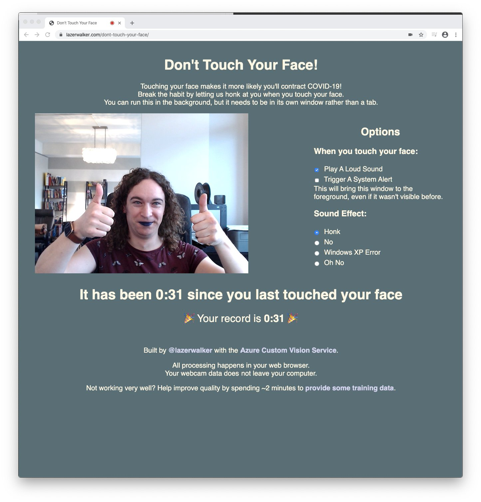
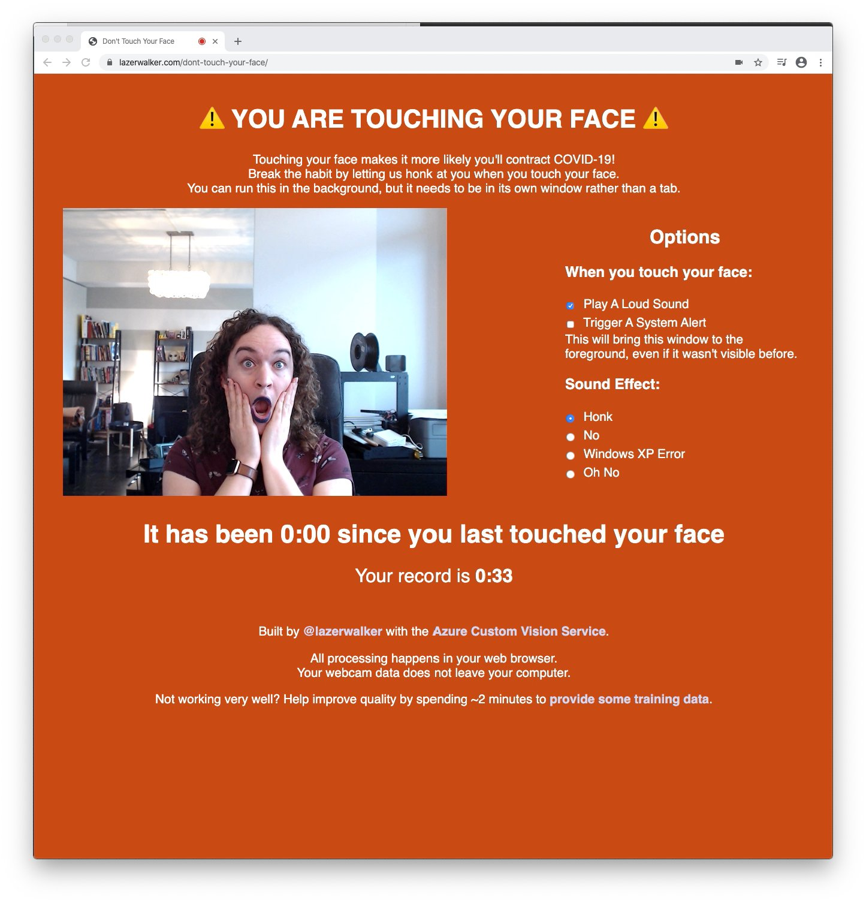

# Don't Touch Your Face!

This is a single-page web app that uses your webcam and a machine learning model to let you know whenever you're touching your face.

A live version of this app can be found at https://lazerwalker.com/dont-touch-your-face

It's built using the [Azure Custom Vision Service](https://azure.microsoft.com/services/cognitive-services/custom-vision-service/?WT.mc.id=aiml-0000-emwalker#features). Using a TensorFlow.js model exported from Custom Vision, it runs entirely within the user's web browser; no webcam data leaves your computer.

If you're interested in a higher-level overview of how it functions and the various techniques I tried to train my ML model, I wrote a [blog post](https://medium.com/microsoftazure/how-you-can-use-computer-vision-to-avoid-touching-your-face-34a426ffddfd) explaining that journey.

 

## Setting up a development environment

After cloning this git repo, run `npm install` to install dependencies.

`npm run dev` will spin up a local development server (at `http://localhost:1234` by default). This will also auto-watch for changes made to HTML, CSS, or TypeScript files, automatically recompile, and attempt to hot-reload any connected browser clients.

The TensorFlow.js model I'm using is included in this repo as well. If you want to swap in your own machine learning model, just replace the contents of the `model` folder with whatever model you would like. If you're training your own model on https://customvision.ai, you'll want to make sure to choose a "compact" model. Either way, yuo'll likely need to tweak some code in `src/touchingDetector.ts` as well to accommodate any differences in data you're receiving back (e.g. the number of classification or object detection tags you receive)
